# 🦆 DuckLens – Retail Data Access Layer

> **"Turning messy POS data into clean, commercial truth — for Bidco and Africa's shelves."**

---

## 🚀 Project Overview

**Goal**: Deliver clean KPIs, Promo Insights, Pricing Index, and Data Health for Bidco Africa (FMCG leader)  
**Client**: Bidco Africa — leading FMCG player in Eastern Africa  
**Input**: Raw Excel export (`Test_Data.xlsx`) from one retailer  
**Output**: Actionable dashboards + JSON API endpoints for brand managers (non-technical users)  
**Delivery**: Apache Superset Dashboard + FastAPI REST Endpoints

# 🦆 DuckLens – Retail Data Access Layer

## 📌 Executive Summary

Goal: turn a raw Excel export into promo insights, pricing index, and data health—served in Superset and FastAPI.  
Stack: Python ETL → PostgreSQL (staging + DW) → Materialized Views → Superset (BI) + FastAPI (API).  
Audience: brand managers and analysts; screenshots included below (placeholders).

---

## 🏗️ Architecture 


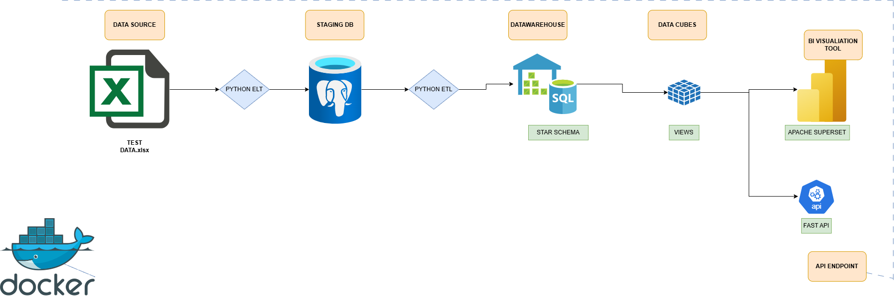

For the detailed ASCII diagram, see `PIPELINE_ARCHITECTURE.md`.

---

## ⭐ ERD (Star schema)


.png>)


Facts: `dw.fact_sales_enriched`  
Dims: `dw.dim_store`, `dw.dim_item`, `dw.dim_supplier`, `dw.dim_date`.

---

## ✅ Data Health (Staging → DW)

📊 Staging data health – key findings
- Total raw records: 30,691
    - After de‑duplication: 30,088 (98.04%)
    - Duplicates removed: 603 (1.96%)
- NULL/Zero RRP: 0
- Critical issues (very low):
    - Negative quantities: 5 (0.02%)
    - Negative sales: 5 (0.02%)
    - Missing store/item/date: 0
- Data quality warnings:
    - Extreme price deviation: 20 (0.07%)
    - Zero quantities: 12 (0.04%)

🎯 Interpreting the health score
- Raw Data Health Score ≈ 49.38 / 100 (penalized by duplicates: 1.96% × 25% weight ≈ −49 pts).
- Accuracy view (ignoring duplicates): ~30 problematic rows / 30,691 (≈0.10%); ~97.9% clean → source system is strong; dedup is the main drag.

📈 Reliability analysis of stores and suppliers
- Reliability score formula:
    Reliability = 100 − [ 50%×(negative_values/txns) + 30%×(extreme_pricing/txns) + 20%×(critical_quality/txns) ]
- Critical rule: any negative quantity or negative sales ⇒ entity is flagged UNRELIABLE (zero‑tolerance).
- Risk flags and thresholds:
    - flag_negative_values: any negative quantity OR negative sales → CRITICAL
    - flag_pricing_issues: >5% transactions with extreme pricing (>50% deviation vs RRP) → HIGH
    - flag_quality_issues: any transactions flagged in cleaning → MEDIUM
    - flag_suspicious_zeros: >5 zero‑quantity transactions with sales → LOW

🏪 Stores – reliability snapshot
- Total stores: 35; Stores with issues: 5 (14.3%); Reliable: 30 (85.7%).
- Average store score: ~99.97 / 100. All 5 flagged stores have exactly 1 negative transaction each (≈0.08–0.12% error rate) but are UNRELIABLE by zero‑tolerance.
- Business actions: investigate POS issues, retrain staff, monitor next loads, consider excluding from critical analytics until fixed.
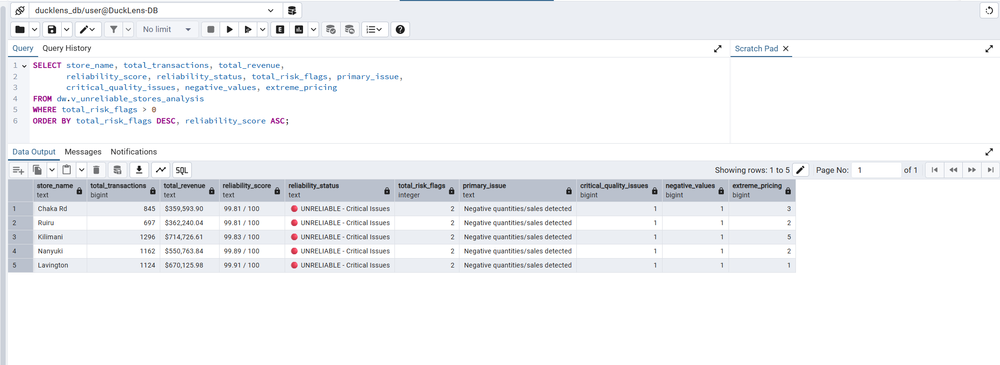

🏭 Suppliers – reliability snapshot
- Total suppliers: 190; Suppliers with issues: 6 (3.2%); Reliable: 184 (96.8%).
- Average supplier score: ~99.95 / 100. Example: one small high‑risk supplier (score ≈85.71; multiple issue types), one large supplier with very low error rate (≈0.06%) but still UNRELIABLE due to critical negatives.
- Business actions: audit invoicing/ERP, enforce validations, delay payments until fixes, flag for manual review on future invoices.
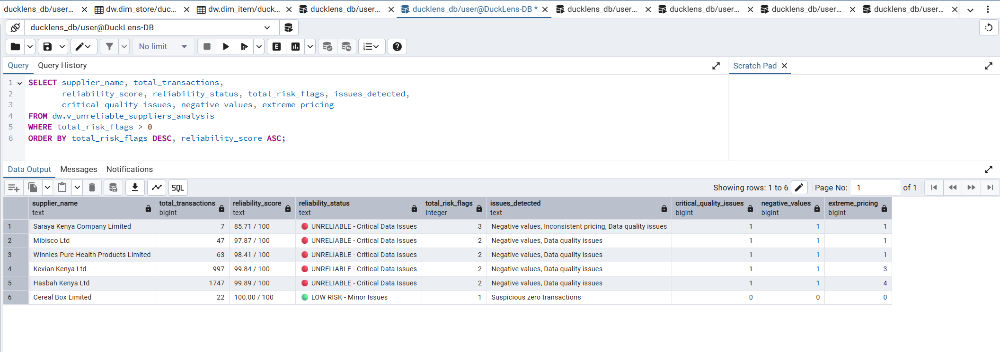

🧾 Data health scorecard (overall)
- Total entities analyzed: 225 (35 stores + 190 suppliers)
- Entities with issues: 11 (4.9%); Fully reliable: 214 (95.1%)
- Average reliability score: ~99.96 / 100
- Strengths: 95% entities have zero issues; completeness 100%; structure solid.
- Concerns: 603 duplicates; 10 entities with negatives; non‑random concentration of issues (specific entities).
- Root causes: duplicates → source double‑processing; negatives → POS/ERP bug/returns processing; extreme pricing → manual overrides/promos.

📷 Screenshots (drop into docs/screenshots/)
- Data Health Overview: docs/screenshots/data_health_overview.png
- Unreliable Stores: docs/screenshots/unreliable_stores.png
- Unreliable Suppliers: docs/screenshots/unreliable_suppliers.png
- Reliability Scorecard: docs/screenshots/reliability_scorecard.png

How to view in the project
- Views: dw.v_staging_data_health, dw.v_data_health_summary, dw.v_unreliable_stores, dw.v_unreliable_suppliers.

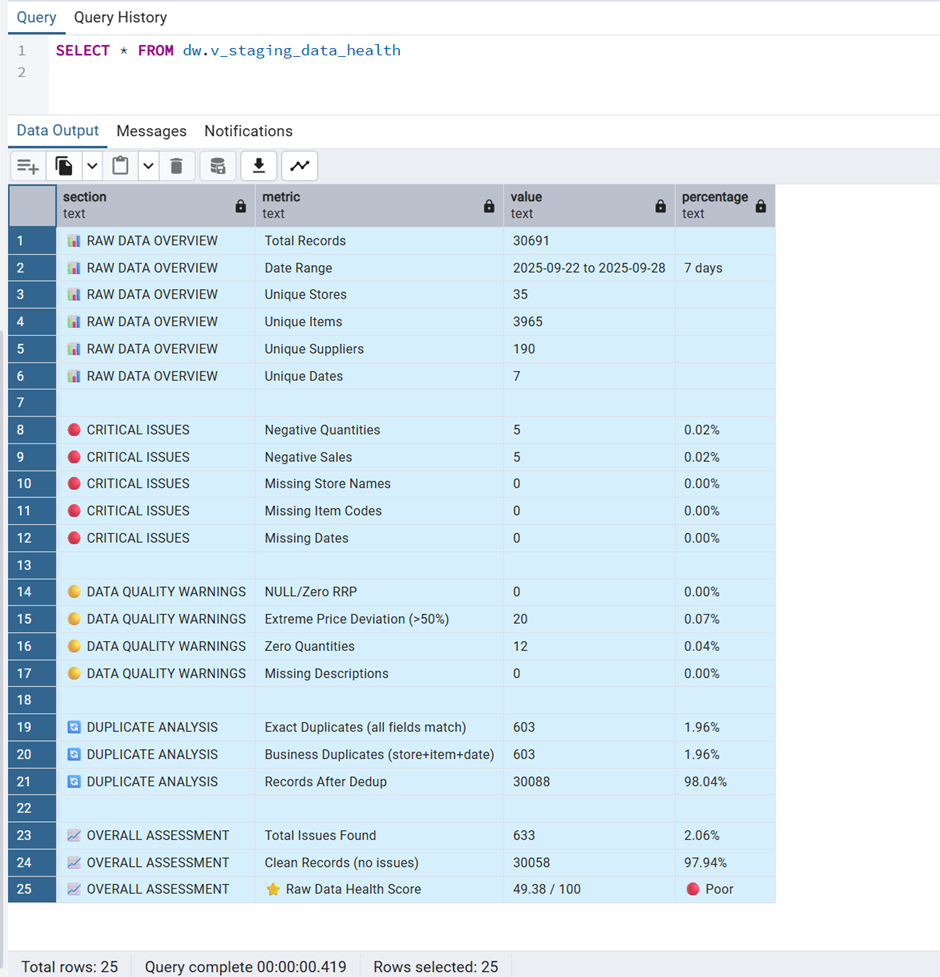


Requirement 1 – Data Health: covered
- Identify missing/duplicated/outliers → counts above; views expose details; screenshots to attach.
- Flag unreliable stores/suppliers → zero‑tolerance flags and reliability bands provided.
- Provide per‑entity health scores + summary → scoring formula + store/supplier snapshots and scorecard.

---

## 🔧 Logic and Assumptions

- Source scope: `Test_Data.xlsx` (one retailer, ~30k rows; 35 stores; 190 suppliers).  
- Unit price: `unit_price = total_sales / NULLIF(quantity, 0)`; negatives hard‑flagged; business duplicates removed on `(store_name, item_code, date, quantity, total_sales)`.  
- Promo detection (rule‑based): `discount_pct = (rrp - unit_price) / NULLIF(rrp, 0)`; set `promo_flag = TRUE` when `discount_pct ≥ 0.10` is sustained for `≥ 2` consecutive days per `(store_name, item_code)`.  
- Uplift vs baseline (per SKU):  
    `baseline_avg_units = AVG(quantity) WHERE promo_flag = FALSE`  
    `promo_avg_units = AVG(quantity) WHERE promo_flag = TRUE`  
    `uplift_pct = (promo_avg_units - baseline_avg_units) / NULLIF(baseline_avg_units, 0) * 100`.  
- Price index (store × sub‑dept × section):  
    `bidco_avg_price = AVG(unit_price WHERE supplier = 'Bidco')`  
    `competitor_avg_price = AVG(unit_price WHERE supplier <> 'Bidco')`  
    `price_index = bidco_avg_price / NULLIF(competitor_avg_price, 0)`  
    `price_difference_pct = (bidco_avg_price - competitor_avg_price) / NULLIF(competitor_avg_price, 0) * 100`.  
    Positioning bands: `> 1.10 Premium`, `1.05–1.10 Slight Premium`, `0.95–1.05 At Market`, `0.90–0.95 Slight Discount`, `< 0.90 Deep Discount`.  
- Realised vs RRP (discounting patterns):  
    `bidco_discount_vs_rrp_pct = (bidco_avg_rrp - bidco_avg_price) / NULLIF(bidco_avg_rrp, 0) * 100`; and  
    `competitor_discount_vs_rrp_pct = (competitor_avg_rrp - competitor_avg_price) / NULLIF(competitor_avg_rrp, 0) * 100`.  
- Data quality controls: zero‑tolerance on negative quantities/sales; reliability flags at store/supplier; RRPs validated (missing/zero handled in cleaning); health scorecards exposed via views.

---

## 💡 What a Brand Learns

- Where Bidco is premium vs discount by store and category.  
- Who discounts more vs RRP (Bidco vs competitors) and where.  
- Promo ROI: uplift %, coverage, discount depth.  
- Store coverage gaps and top performing SKUs.  
- Risky stores/suppliers to audit (negatives, extreme deviations).

---

## ✅ Pricing Index Requirement Coverage

Requirement: “Compare Bidco realised avg unit price vs competitors within the same Sub‑Department and Section, per store; provide store‑level and roll‑up; show realised vs RRP.”

- Store‑level view: `dw.v_price_index_store_level`  
    Fields include: `store_name`, `sub_department`, `section`, `bidco_avg_price`, `competitor_avg_price`, `price_index`, `price_positioning`, `bidco_avg_rrp`, `competitor_avg_rrp`, `bidco_discount_vs_rrp_pct`, `competitor_discount_vs_rrp_pct`.  
    API: `GET /price_index/store_level` (Swagger: http://localhost:8001/docs).  


- Roll‑up view: `dw.v_price_index_overall` and `GET /price_index/by_category`  
    Shows category positioning and discounting patterns; filter by store in Superset to see shifts.  
    Superset: “Realised vs RRP by Category” bar chart. See `PRICING_INDEX_TWO_VISUALS.md` and `PRICING_INDEX_THREE_VISUALS.md`.

---

## 📊 Superset Dashboard

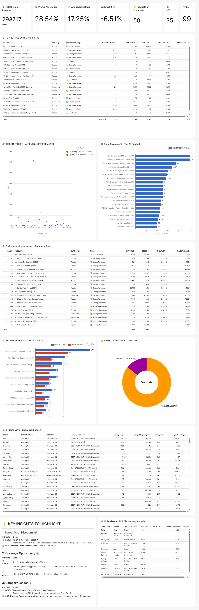

1) Pricing Comparison Table (store × category)  
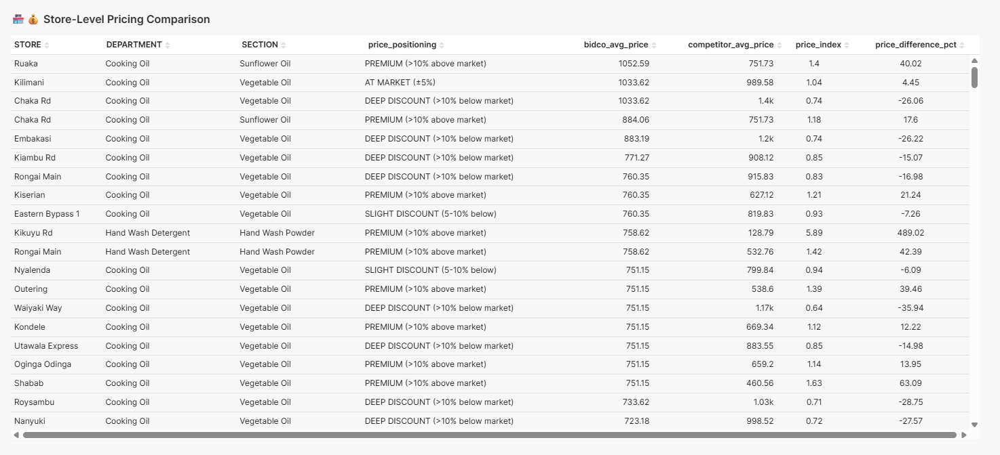

2) Realised vs RRP by Category   
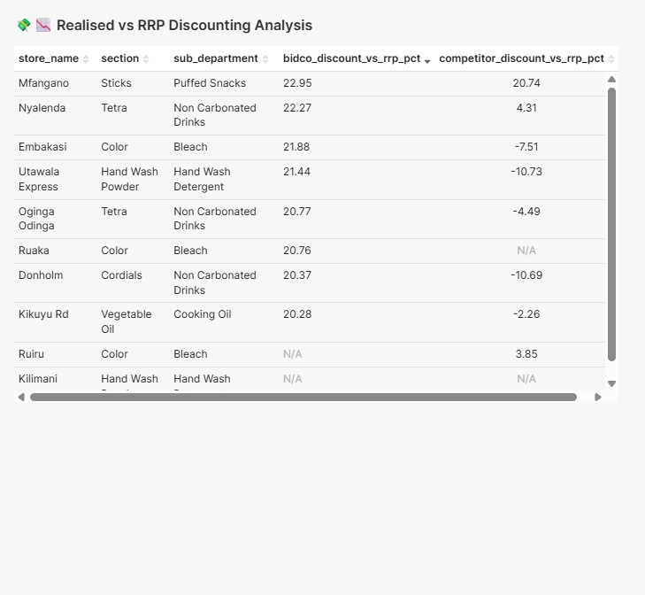

### SUPERSET CHARTS

i. BIDCO PROMO KPIS

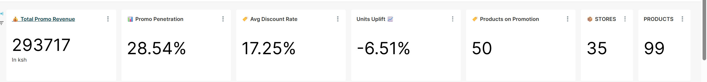

ii. 🚀 TOP 20 PRODUCTS BY UPLIFT %
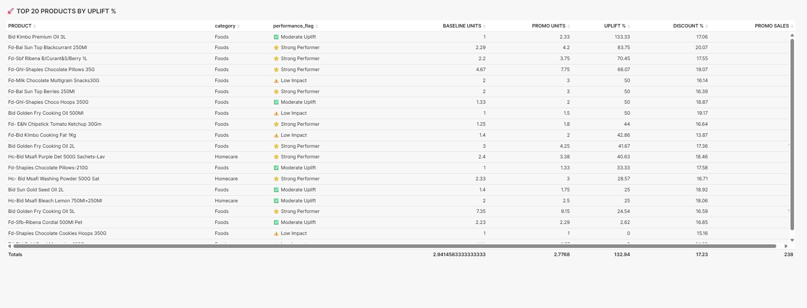

iii. 🎯 DISCOUNT DEPTH vs REVENUE PERFORMANCE


iv. 🗺️ Store Coverage % - Top 20 Products
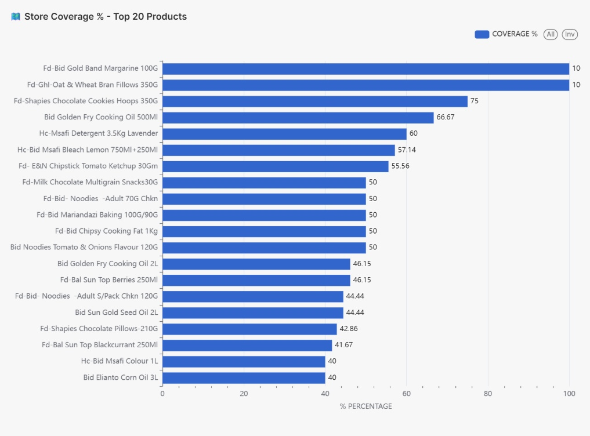

v. 🥇 Performance Leaderboard - Composite Score
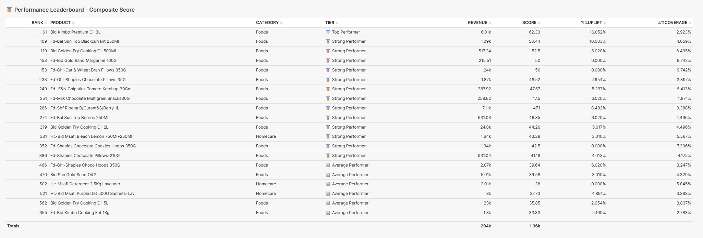

vi. ⚖️ BASELINE vs PROMO UNITS - Top 10
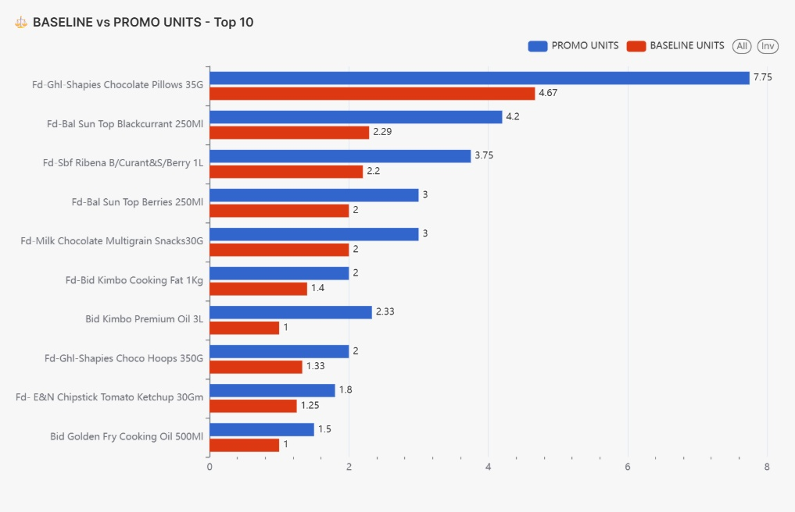

vii. 🥧PROMO REVENUE BY CATEGORY
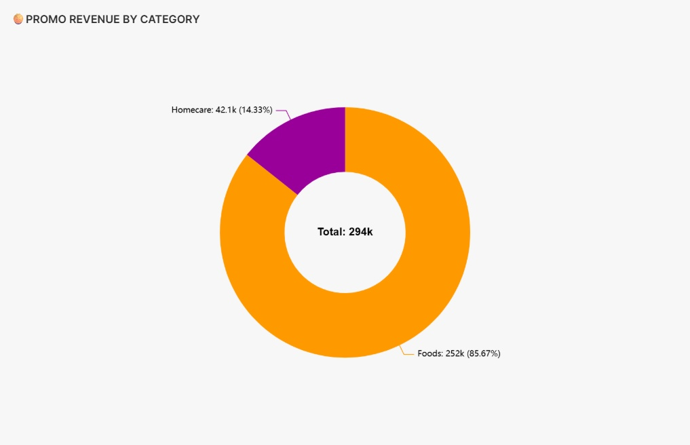

viii. 🏪💰 Store-Level Pricing Comparison
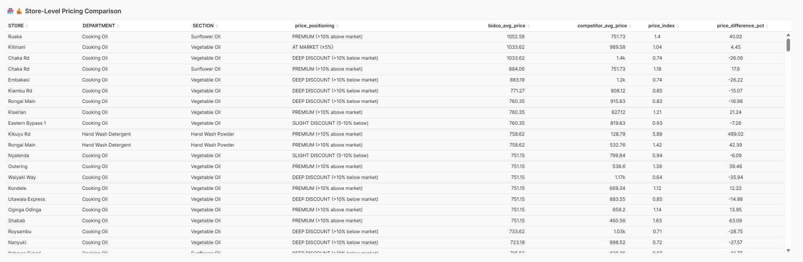

ix. 💸📉 Realised vs RRP Discounting Analysis


x. 💡 KEY INSIGHTS TO HIGHLIGHT

---

## 🔌 FastAPI (Swagger screenshots here)

- `GET /promo_summary` – promo KPIs  
- `GET /price_index/store_level` – store‑level price index with realised vs RRP  
- `GET /price_index/by_category` – category roll‑up  

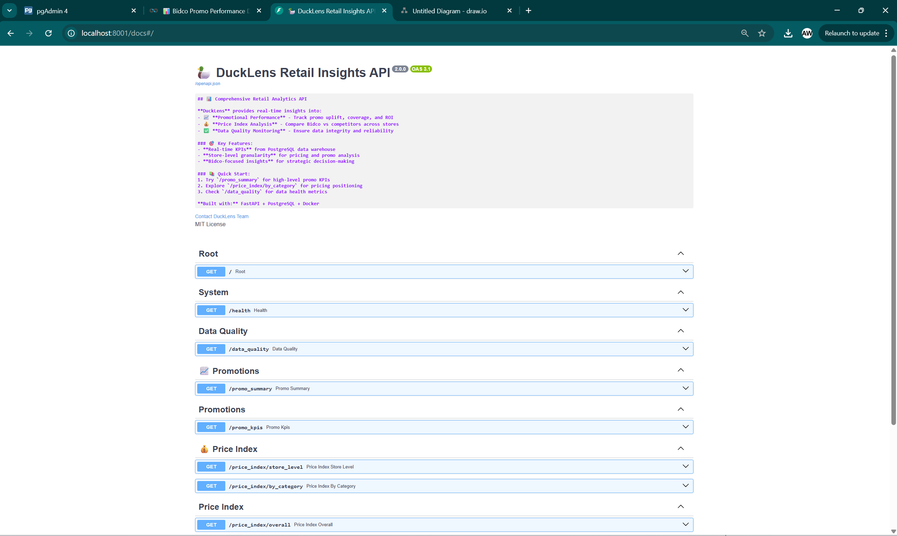
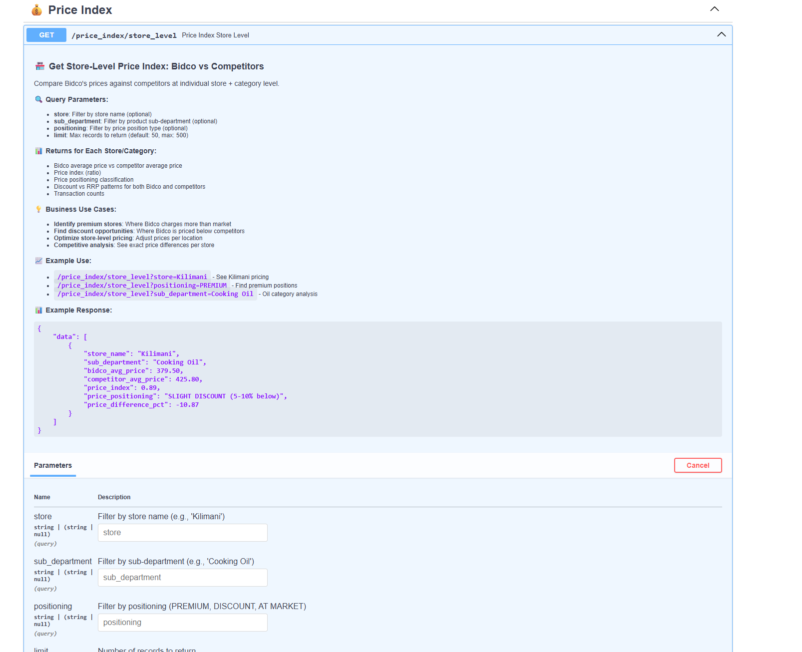
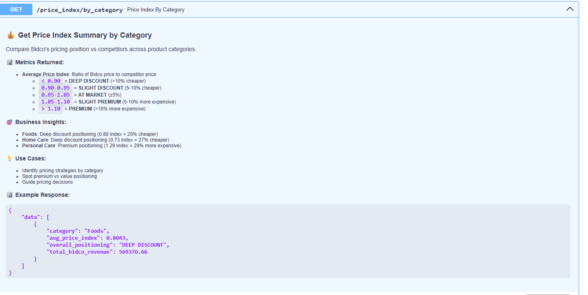


---

## 🏃 How to Run (brief)

```bash
# start services
docker-compose up -d

# open
# Superset: http://localhost:8088
# API docs: http://localhost:8001/docs
# pgAdmin: http://localhost:5050
o	Email: admin@admin.com
o	Password: admin

```


## BY JAYSON GOR

---

## 🔐 Public demo credentials (for reviewers)

This repository includes demo credentials to make local review easy. These are non-production values intended for sandbox use only:
- PostgreSQL: user=user, password=password, db=ducklens_db
- pgAdmin: admin@admin.com / admin
- Superset: admin / admin (set at init)

Note: Do not reuse these in any real environment. Replace in `.env` before deploying anywhere beyond local.

